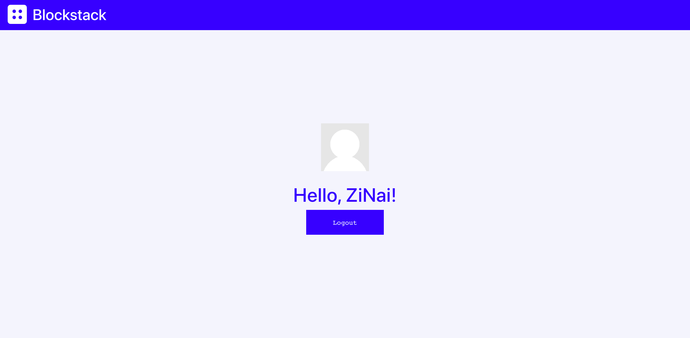

# Comments-D

> 一个基于BlockStack的去中心化简易Blog评论系统


## Features (TODO)

- 简单易用
- 去中心化存储
- 评论收藏
- 比特币打赏
- 支持markdown
- bolg订阅
- 每日趣评....

## Usage

```bash
# 安装依赖
npm install
# 启动服务
npm start
```
## Reuslt



## 数据部分交互构想

  1. App需要一个Gaia来存储Blog接入该系统的用户数据。
  2. 用户的身份可以是**Blog 所有者**或者**Blog 文章评论者**
  3. 用户数据包括用户的DID，Blog Domain，文章Url，评论，时间等
  4. 用户的评论分为公开与隐藏两种类型，但是每条评论数据默认都会在3个地方记录：**Blog 所有者**、**Blog 文章评论者** 以及**系统本身**
  5.  用户可以选择是否允许系统记录该条评论
  6.  系统记录用户评论是为了后续的一些想法做铺垫
  7.  系统首先会是一个简单易用的去中心化blog评论系统
